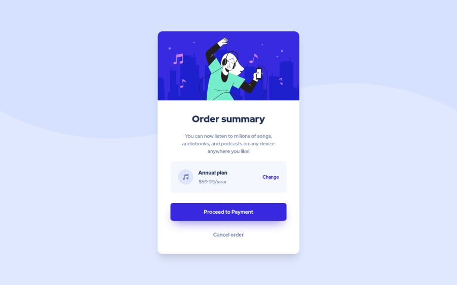

# Frontend Mentor - Order summary card solution

This is a solution to the [Order summary card challenge on Frontend Mentor](https://www.frontendmentor.io/challenges/order-summary-component-QlPmajDUj). Frontend Mentor challenges help you improve your coding skills by building realistic projects. 

## Table of contents

- [Overview](#overview)
  - [The challenge](#the-challenge)
  - [Screenshot](#screenshot)
  - [Links](#links)
- [My process](#my-process)
  - [Built with](#built-with)
  - [What I learned](#what-i-learned)
- [Author](#author)

## Overview

### The challenge

Users should be able to:

- See hover states for interactive elements

### Screenshot



### Links

- Live Site URL: [https://priceless-goodall-c3da70.netlify.app/](https://priceless-goodall-c3da70.netlify.app/)

## My process

### Built with

- Semantic HTML5 markup
- [Tailwind CSS](https://tailwindcss.com/) - For styles

### What I learned

In this solution, I wanted to learn Tailwind CSS in practice. I need to customize tailwind configuration to adjust styles to the challenge style guide. You can check my configuration below:

```js
module.exports = {
  purge: [],
  darkMode: false,
  theme: {
    extend: {
      colors: {
        primary: {
          100: 'hsl(225, 100%, 94%)',
          200: 'hsl(245, 75%, 52%)'
        },
        neutral: {
          100: 'hsl(225, 100%, 98%)',
          200: 'hsl(224, 23%, 55%)',
          300: 'hsl(223, 47%, 23%)'
        }
      },
      fontFamily: {
        body: ['Red Hat Display']
      },
      boxShadow: {
        blue: '0 16px 32px -12px hsla(245, 75%, 52%, 0.64)'
      },
      fontWeight: {
        regular: 500,
        medium: 700,
        black: 900
      },
      backgroundImage: {
        bgMobile: "url('/assets/images/pattern-background-mobile.svg')",
        bgDesktop: "url('/assets/images/pattern-background-desktop.svg')", 
      }
    },
  },
  variants: {
    extend: {},
  },
  plugins: [],
}

```

## Author

- Frontend Mentor - [@przemg](https://www.frontendmentor.io/profile/przemg)
